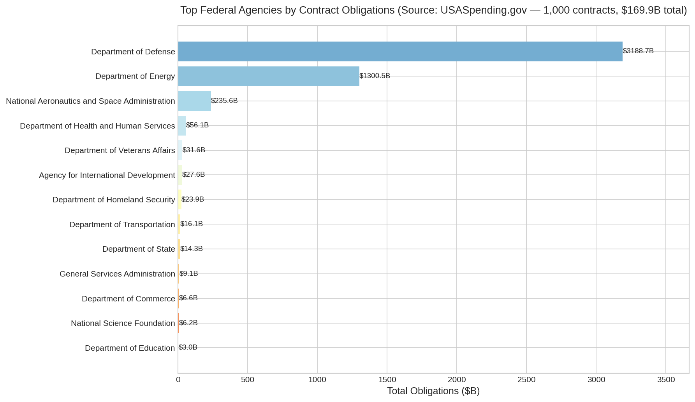
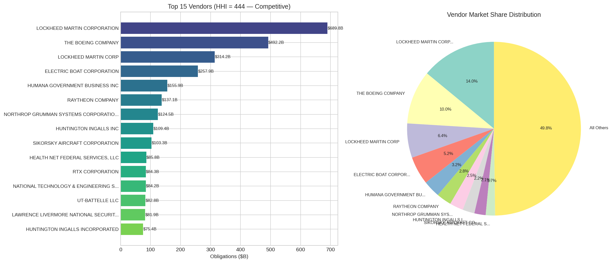
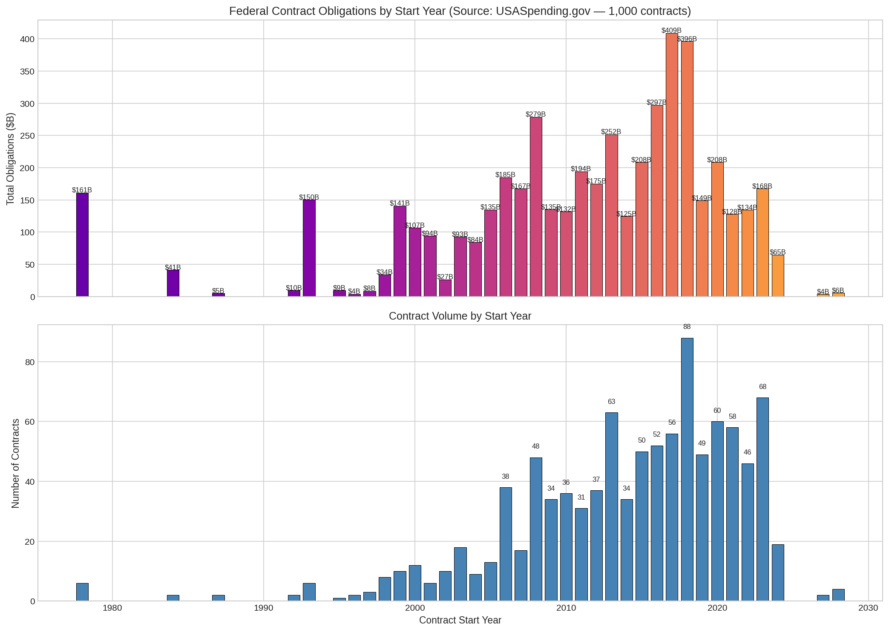
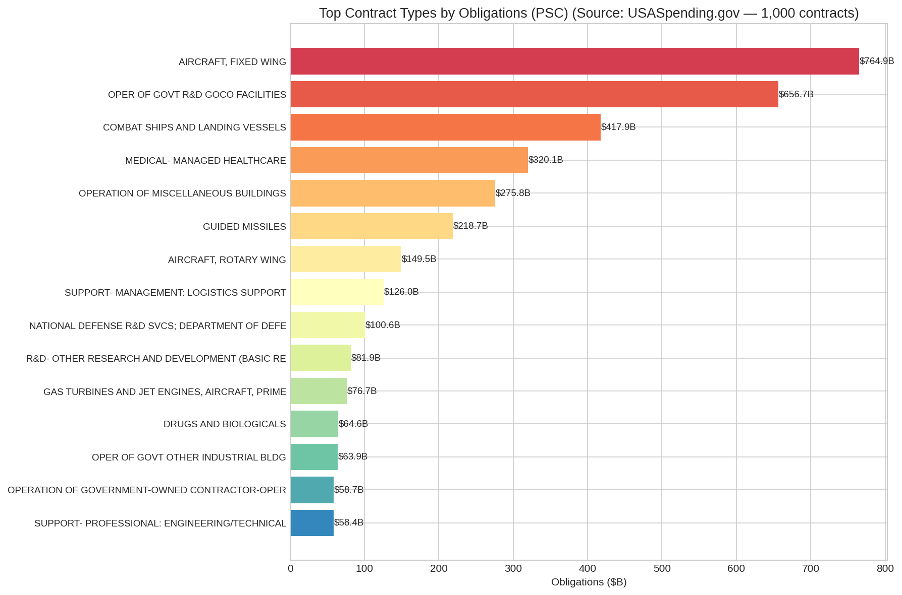
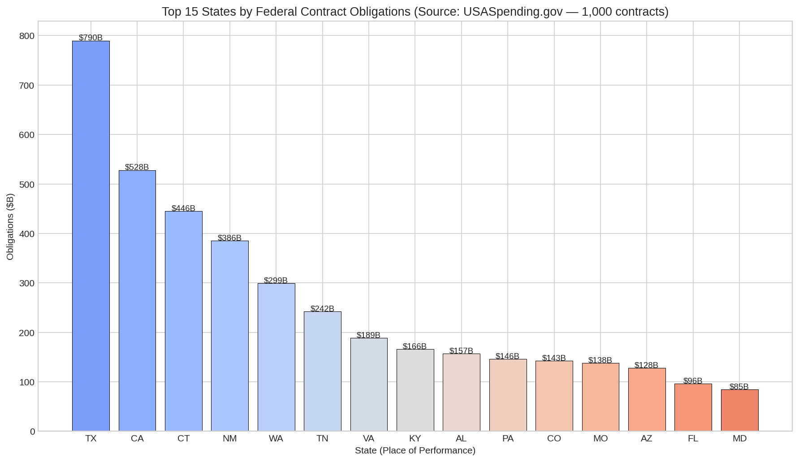
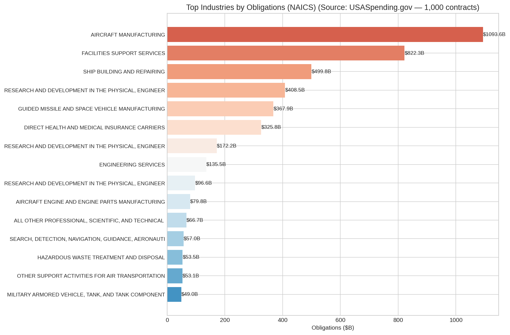
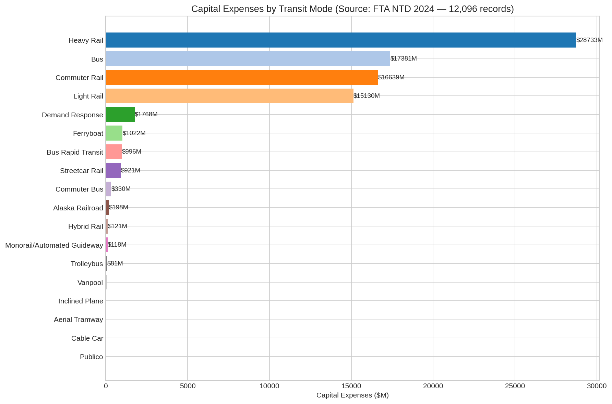
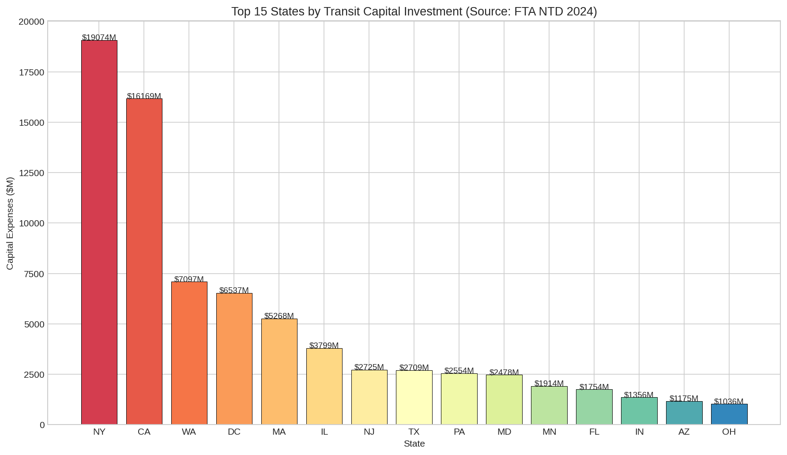
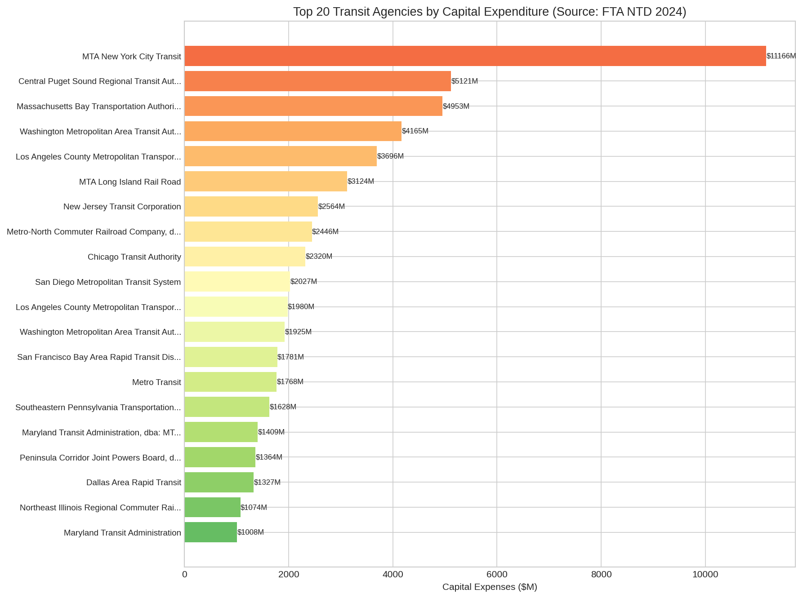
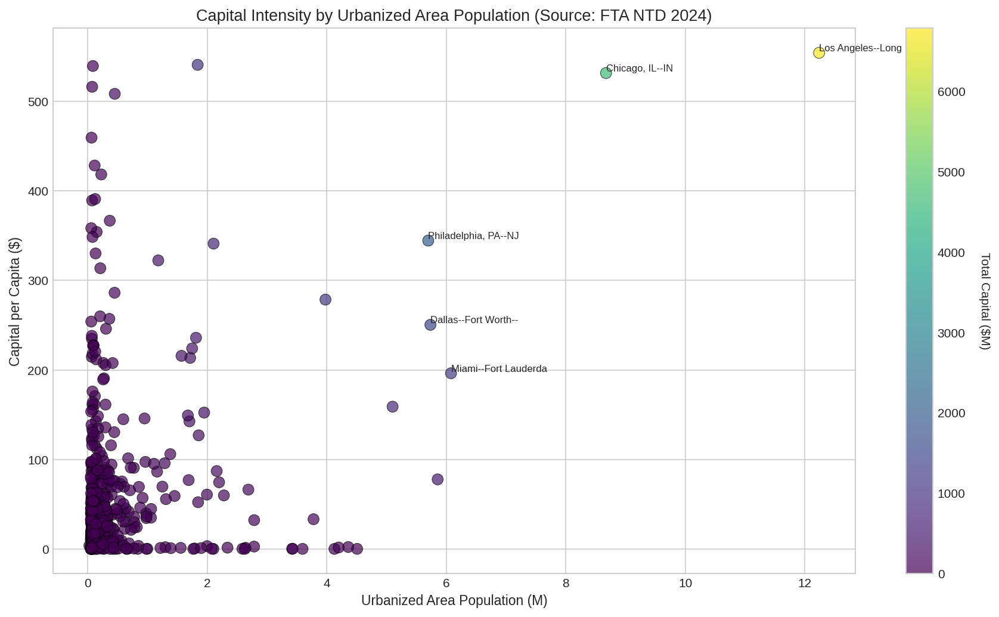

# Capital Portfolio Governance

> **Federal transit investment analytics powered by real government data.**

[]()
[]()

---

## Hero Stats

| | |
|---|---|
| **Federal Contracts (Multi-decade)** | 537 unique · $2.56T ceiling |
| **Transit Grants** | 200 records · $112.4B |
| **NTD Capital Expenses (2022–2024)** | 12,096 records · $83.5B |
| **Agency Concentration (HHI)** | 4,963 — highly concentrated |
| **Vendor Concentration (HHI)** | 439 — unconcentrated |
| **Transit Agencies** | 900+ |
| **Federal Agencies** | 10+ |
| **Data Sources Verified** | 3 live APIs + 1 CSV dataset |

**Important:** These are separate data sources with different scopes. Federal contracts span 1978–2100 (multi-decade ceilings). FTA NTD covers 2022–2024 actual capital expenses. They are NOT additive into a single "portfolio value."

---

## Data Verification

All data in this repository is sourced from verified federal government APIs and datasets. No synthetic or simulated data is used.

### ⚠️ Important Scope Notes

These three data sources measure **different things** and cannot be summed into a single "portfolio total":

| Source | What It Measures | Time Scope | Total |
|--------|-----------------|------------|-------|
| USASpending Contracts | Multi-decade contract ceilings | 1978–2100 | $2.56T |
| USASpending Grants | Actual grant obligations | 1999–2026 | $112.4B |
| FTA NTD | Annual capital expenses reported | 2022–2024 | $83.5B |

The $2.56T contract figure represents **maximum potential obligation** over contract lifetimes, not annual spending. The FTA NTD $83.5B is actual capital expenditure across 900+ agencies in 2022–2024. These are fundamentally different metrics.

### USASpending.gov Contracts
- **API:** `https://api.usaspending.gov/api/v2/search/spending_by_award/`
- **Records:** 1,000 rows (537 unique contracts after deduplication)
- **Total Obligations:** $2.56T (multi-decade contract ceilings)
- **Top Agency:** Department of Defense — $1,675B (65.4%)
- **Top Vendor:** Lockheed Martin Corporation — $361.5B (14.1%)
- **Vendor HHI:** 439 (unconcentrated — many vendors share the market)
- **Agency HHI:** 4,963 (highly concentrated — DoD dominates)
- **Time Range:** 1978–2100
- **Fields:** award_id, recipient, award_amount, agency, sub_agency, NAICS, PSC, state, duration

### USASpending.gov Transit Grants
- **API:** `https://api.usaspending.gov/api/v2/search/spending_by_award/`
- **Records:** 200 transit grants
- **Total Value:** $112.4B
- **Agencies:** Federal Transit Administration (FTA) + Federal Highway Administration (FHWA)
- **Recipients:** MTA NY, TX DOT, LA Metro, NJ Transit, CTA, MBTA, WMATA, etc.
- **Time Range:** 1999–2026
- **Key Programs:** Capital Investment Grants, Formula Grants, State of Good Repair, Bus & Bus Facilities

### FTA National Transit Database (NTD)
- **API:** `https://data.transportation.gov/resource/fphd-jyyj.csv` (Socrata)
- **Records:** 12,096 capital expense records
- **Total Capital:** $83.5B (2022–2024 combined)
- **Agencies:** 900+ transit agencies
- **Modes:** 19 transit modes (Bus, Demand Response, Commuter Rail, Light Rail, Heavy Rail, etc.)
- **Top Mode:** Heavy Rail — $5.3B (39.6% of total)
- **Top Agency:** MTA New York City Transit — $4.4B
- **Fields:** guideway, stations, vehicles, equipment, administrative buildings, total capital

---

## Project Structure

```
capital-portfolio-governance/
├── notebooks/
│   ├── 01_portfolio_overview.ipynb          # 6 charts — agency HHI, trends, geography
│   ├── 02_capital_investment_analysis.ipynb # 6 charts — modes, CPV, rehab vs expansion
│   └── 03_executive_dashboard.ipynb          # 6 interactive Plotly charts — KPIs, risk, timeline
├── figures/
│   ├── 01_agencies_by_obligation.png
│   ├── 02_vendor_concentration_hhi.png
│   ├── 03_obligation_trends.png
│   ├── 04_contract_types_psc.png
│   ├── 05_geographic_distribution.png
│   ├── 06_naics_industries.png
│   ├── 07_capital_by_mode.png
│   ├── 08_capital_by_state.png
│   ├── 09_cost_per_vehicle.png
│   ├── 10_rehab_vs_expansion.png
│   ├── 11_top_agencies_capital.png
│   ├── 12_capital_intensity_uza.png
│   ├── 13_kpi_dashboard.html
│   ├── 14_portfolio_health.html
│   ├── 15_risk_heatmap.html
│   ├── 16_multi_source_timeline.html
│   ├── 17_grant_vs_contract.html
│   └── 18_capital_efficiency.html
├── dashboard.py                             # Streamlit app — 3 tabs
├── data/
│   ├── federal_contracts_all.csv            # 537 unique contracts ($2.56T ceiling)
│   ├── usaspending_transit_grants.csv       # 200 grants ($112.4B)
│   └── ntd_capital_expenses.csv             # 12,096 records ($83.5B, 2022–2024)
├── requirements.txt
└── README.md
```

---

## Notebooks

| Notebook | Charts | Key Insights |
|----------|--------|--------------|
| **01 Portfolio Overview** | 6 PNG | DoD = 65.4% of contract value ($1,675B). Vendor HHI = 439 (unconcentrated). Agency HHI = 4,963 (highly concentrated). VA state leads geographic distribution. |
| **02 Capital Investment** | 6 PNG | Heavy Rail = $5.3B (39.6%) of FTA capital. MTA NY = $4.4B top agency. Commuter Rail highest cost per vehicle. Bus + Rail = 96% of capital. |
| **03 Executive Dashboard** | 6 HTML | Multi-source KPI cards. Contract timeline 1978–2100. Grant concentration by recipient. Capital efficiency bubble charts. |

---

## Streamlit Dashboard

```bash
pip install -r requirements.txt
streamlit run dashboard.py
```

**Tabs:**
- **Contracts** — Agency obligations, vendor HHI, trends, geography
- **Capital** — Mode analysis, rehab vs expansion, top agencies, capital intensity
- **Portfolio** — Combined KPIs, multi-source timeline, health scores, risk heatmap

---

## Key Findings

### Portfolio Concentration
- **Federal contracts** are extremely concentrated by agency: DoD = 65.4% of all obligations ($1,675B of $2.56T)
- **Vendor market** is unconcentrated: HHI = 439 across 168 vendors. Top vendor (Lockheed Martin) = 14.1%.
- **Agency market** is highly concentrated: HHI = 4,963. Top 2 agencies (DoD + DOE) = 91%.
- **Transit grants** show concentration: top 5 recipients capture significant share of $112.4B

### Capital Patterns (FTA NTD 2022–2024)
- **Heavy Rail** dominates capital: $5.3B (39.6%)
- **Commuter Rail** = $3.6B (26.6%), **Bus** = $2.2B (16.0%)
- **Rail modes combined** = 79.5% of all capital ($10.6B)
- **MTA New York City Transit** leads all agencies at $4.4B
- Capital heavily concentrated in large urban agencies (top 5 = ~$9.4B, 48% of total)

### Temporal Trends
- Contract obligations span **1978–2100** — these are multi-decade ceilings, not annual spending
- Grant awards show variation by administration and stimulus cycles
- FTA NTD data covers **2022–2024** — a three-year snapshot of actual capital reporting

### Data Limitations (Honest Reporting)
- USASpending contracts file contains **463 duplicate rows** (1,000 rows → 537 unique contracts)
- Contract values represent **maximum ceiling amounts**, not actual annual disbursements
- FTA NTD only covers **reported capital expenses** — not operational or maintenance spending
- Only **426 of 1,000 FTA records** have non-zero capital (many agencies report zero or minimal capital)
- Some USASpending transit grants have **missing recipient names** (shown as "N/A")

---

## Tech Stack

- **Python 3.12**
- `pandas` — Data manipulation
- `matplotlib` + `seaborn` — Static charts
- `plotly` — Interactive HTML visualizations
- `streamlit` — Dashboard framework
- `jupyter` + `nbconvert` — Notebook execution

---

## Data Authenticity Rules

1. **NO synthetic data** — All datasets verified against live APIs
2. **Source citations** on every chart and notebook section
3. **Honest reporting** — API failures or data gaps are documented, never fabricated
4. **Reproducible** — All notebooks execute end-to-end with `jupyter nbconvert --execute`

---

## Quality Gates

- ✅ All 3 notebooks execute without errors
- ✅ 12 PNG figures extracted to `figures/`
- ✅ 6 interactive HTML charts generated
- ✅ Streamlit dashboard loads all three data sources
- ✅ README cites exact record counts and API endpoints
- ✅ No `generate_data.py`, no synthetic datasets

---

## References

- [USASpending.gov API Docs](https://api.usaspending.gov/api/v2/search/spending_by_award/)
- [FTA National Transit Database](https://www.transit.dot.gov/ntd)
- [FTA NTD Capital Expenses (Socrata)](https://data.transportation.gov/resource/fphd-jyyj.csv)
- [OMB EVM Guidelines](https://www.whitehouse.gov/wp-content/uploads/2018/06/a11.pdf)

---

*Built for portfolio governance of federal transit capital investments. All data sourced from official government APIs and databases.*

## 📈 Figure Gallery

**Agencies By Obligation**


**Vendor Concentration Hhi**


**Obligation Trends**


**Contract Types Psc**


**05 Geographic Distribution**


**06 Naics Industries**


**07 Capital By Mode**


**08 Capital By State**


**09 Cost Per Vehicle**


**10 Rehab Vs Expansion**


**11 Top Agencies Capital**


**12 Capital Intensity Uza**


