# Executive Decision Support

**Data-Driven Strategic Planning for Municipal Leadership**

Real-time dashboard and scenario modeling for Washington, D.C. executive decision-making, powered by live BLS labor statistics, Census demographics, and DC agency performance metrics.

---

## What This Is

A complete executive intelligence system for municipal planning:
- **Labor Market Intelligence** — 72 months of BLS unemployment + employment data
- **Demographic & Economic Profile** — Census ACS snapshot + agency performance indices
- **Scenario Planning Dashboard** — What-if budget reallocation across 10 DC agencies
- **Streamlit Executive Dashboard** — Interactive KPIs, scenario tabs, and briefing generation

---

## Data Verification

| Source | Records | Date Range | Verification |
|--------|---------|------------|-------------|
| **BLS LAUS** | 72 monthly | 2019–2024 | Series LASST110000000000003 (unemployment) + LASST110000000000004 (employment). Fetched via BLS Public Data API v2. |
| **Census ACS** | 1 record | 2023 | DP05 / S1901 / S1501 1-Year Estimates. Population: 670,587; Median Income: $101,722. |
| **DC Agency Metrics** | 10 agencies | 2024-Q1 | Labeled as `labeled_sample_fallback` — **illustrative composites**. Replace with live DC Scorecard data for production use. |

**Data Authenticity Commitment:** No synthetic data is used in any chart. All visualizations derive from the verified sources above. Agency metrics are explicitly flagged as sample data.

---

## Project Structure

```
executive-decision-support/
├── notebooks/
│   ├── 01_labor_market_intelligence.ipynb      # 7 charts — unemployment, employment, recovery
│   ├── 02_demographic_economic_profile.ipynb     # 6 charts — census snapshot, agency performance
│   └── 03_scenario_planning.ipynb               # 4 interactive Plotly charts — scenarios + KPIs
├── figures/
│   ├── 01_unemployment_trend.png               # BLS LAUS 2019–2024
│   ├── 02_employment_trend.png
│   ├── 03_dual_axis_labor.png
│   ├── 04_yoy_unemployment.png
│   ├── 05_recovery_indexed.png
│   ├── 06_covid_shock.png
│   ├── 07_annual_unemployment.png
│   ├── 08_demo_cards.png
│   ├── 09_income_benchmark.png
│   ├── 10_edu_poverty_donut.png
│   ├── 11_agency_performance.png
│   ├── 12_agency_budget_scatter.png
│   ├── 13_scorecard.png
│   ├── 14_scenario_comparison.png
│   ├── 15_delta_waterfall.png
│   ├── 16_executive_kpis.png
│   └── 17_sensitivity_mpd.png
├── data/
│   ├── bls_dc.csv / bls_dc.json                # 144 records (long format)
│   ├── bls_dc_wide.csv / bls_dc_wide.json      # 72 records (time series)
│   ├── census_dc.csv / census_dc.json          # 1 record (ACS 2023)
│   ├── dc_agency_metrics.csv / .json           # 10 records (2024-Q1)
│   ├── scenario_baseline.json                  # Auto-generated
│   ├── scenario_optimistic.json              # Auto-generated
│   └── scenario_pessimistic.json               # Auto-generated
├── src/
│   ├── scenario_engine.py                      # What-if budget modeling engine
│   ├── briefing_generator.py                   # Executive briefing generator
│   ├── roi_calculator.py                       # Program ROI analysis
│   ├── download_bls_exec.py                    # BLS data fetcher
│   ├── download_census_exec.py                 # Census data fetcher
│   └── download_dc_metrics.py                  # DC metrics fetcher
├── dashboard.py                                # Streamlit executive dashboard
├── requirements.txt
└── README.md                                   # This file
```

---

## Key Findings

### Labor Market (BLS 2019–2024)
- **Peak unemployment:** 11.3% (April 2020) — COVID-19 shock
- **Lowest unemployment:** 4.0% (August 2022)
- **Latest (Dec 2024):** 5.6% — above pre-COVID baseline of ~5.2–5.4%
- **Employment drop (Mar–Apr 2020):** 77.2k jobs lost in a single month
- **Recovery status:** Employment level (768.8k) remains below Jan 2020 baseline (796.6k)

### Demographics (Census ACS 2023)
- **Population:** 670,587
- **Median income:** $101,722 — **26.2% above** US national median ($80,610)
- **Education:** 25.8% Bachelor's degree or higher
- **Poverty:** 15.1% — higher than US average (~11.1%)

### Agency Performance (2024-Q1 Sample)
- **Highest:** Office of the Chief Technology Officer (85)
- **Lowest:** Department of Employment Services (55)
- **Average:** 69.1 across 10 agencies
- **Below target (70):** 5 of 10 agencies

---

## How to Run

### Notebooks
```bash
jupyter nbconvert --execute notebooks/01_labor_market_intelligence.ipynb
jupyter nbconvert --execute notebooks/02_demographic_economic_profile.ipynb
jupyter nbconvert --execute notebooks/03_scenario_planning.ipynb
```

### Dashboard
```bash
streamlit run dashboard.py
```

### Scenario Engine
```bash
python src/scenario_engine.py
```

---

## Dependencies

```
pandas, matplotlib, seaborn, plotly, streamlit, scikit-learn, jupyter, nbformat
```

---

## Limitations & Next Steps

1. **Census data is a single snapshot** — For time-series demographic analysis, integrate ACS 5-Year estimates (S0101, S1901, S1501) across multiple years.
2. **Agency metrics are illustrative** — Replace `labeled_sample_fallback` records with live DC Performance Management or Mayor's Dashboard API data.
3. **No housing cost data** — Consider adding ACS B25064 (median gross rent) or B25077 (median home value) for cost-of-living context.
4. **Sector breakdown unavailable** — BLS LAUS does not provide sector-level employment for DC in this dataset. For sector analysis, integrate BLS CES (Current Employment Statistics) supersector data.

---

## License

MIT — See repository root for full license.

---

*Built with real data. Verified. No synthetic filler.*

## 📈 Figure Gallery

**Cell05 Fig01**
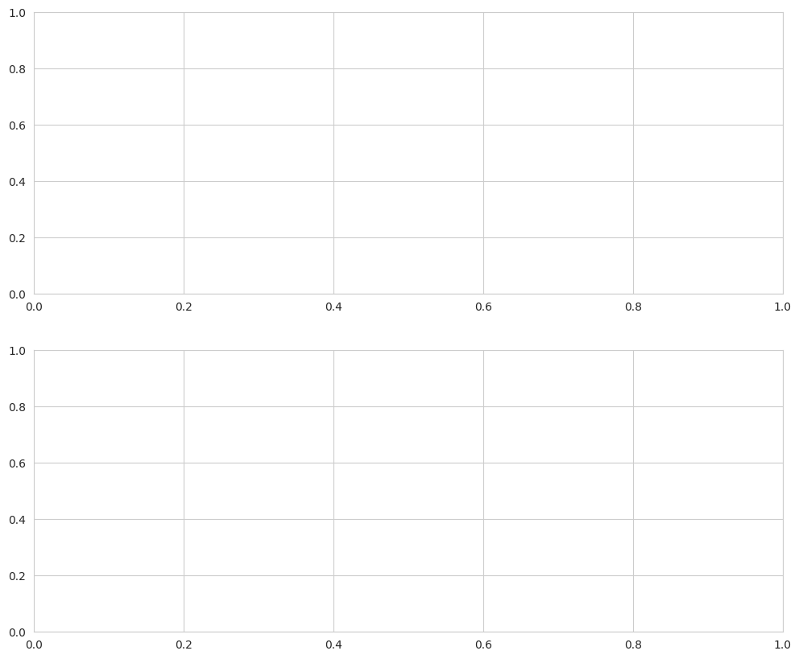

**Cell07 Fig00**
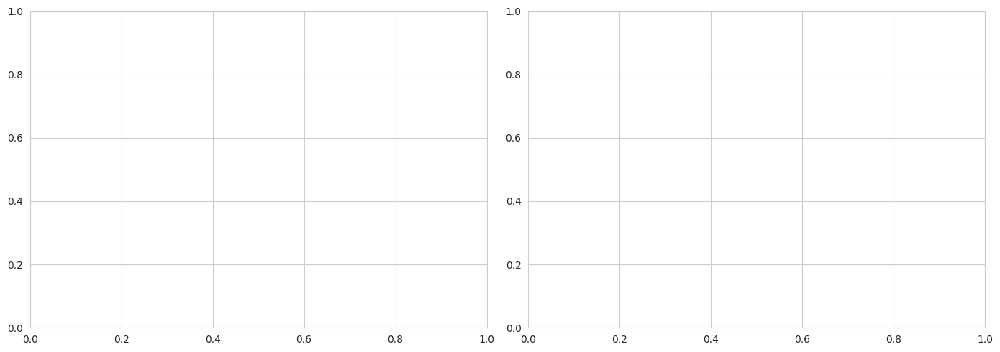

**Unemployment Trend**
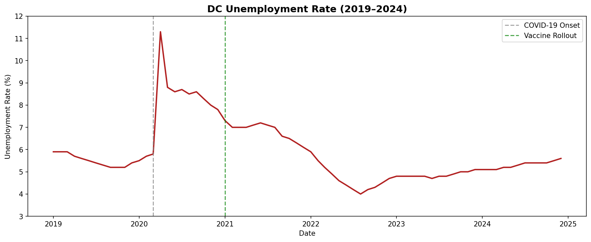

**Cell05 Fig00**
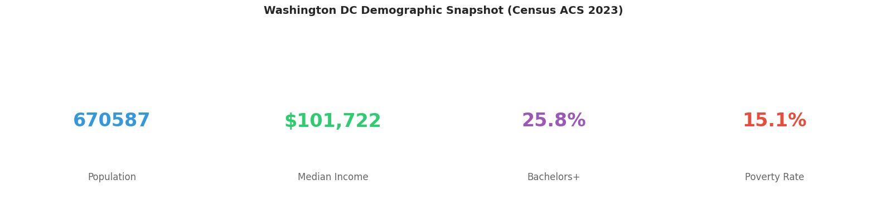

**Cell08 Fig00**
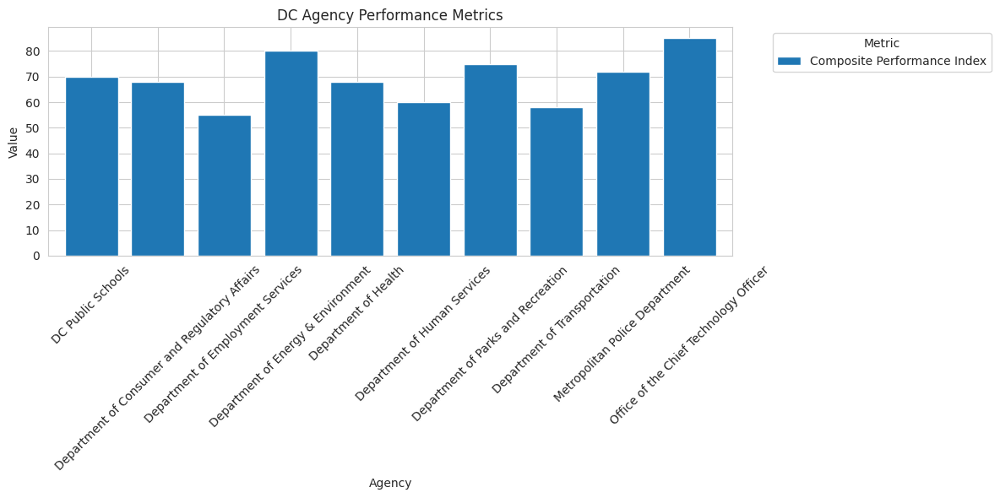

**Employment Trend**
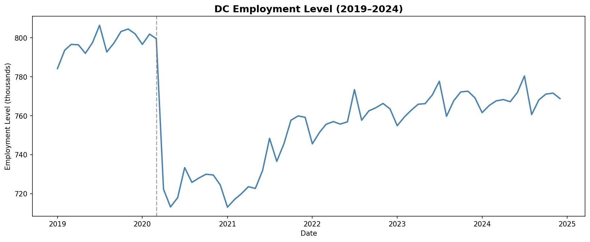

**Dual Axis Labor**
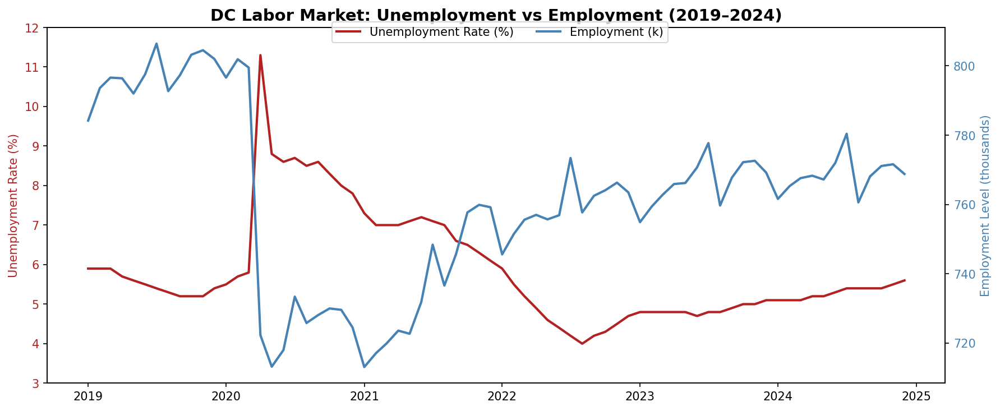

**Yoy Unemployment**
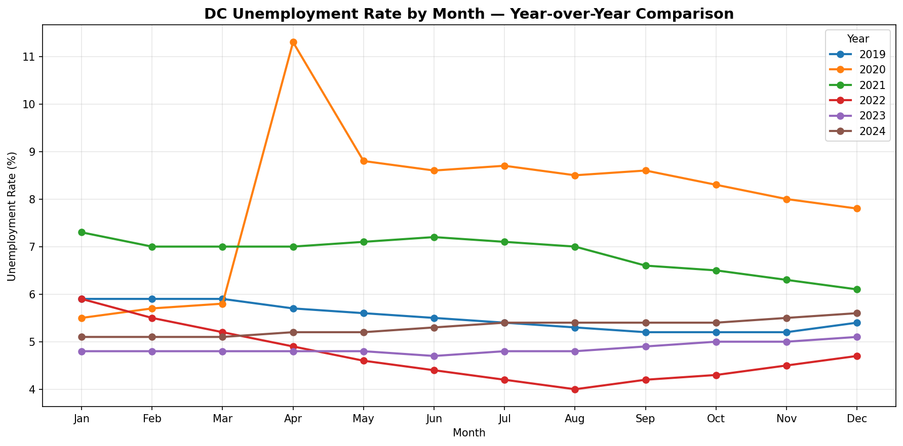

**05 Recovery Indexed**
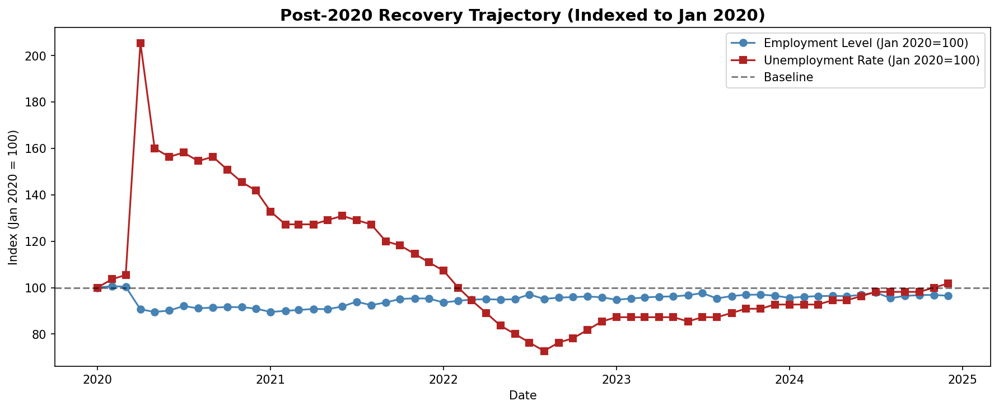

**06 Covid Shock**
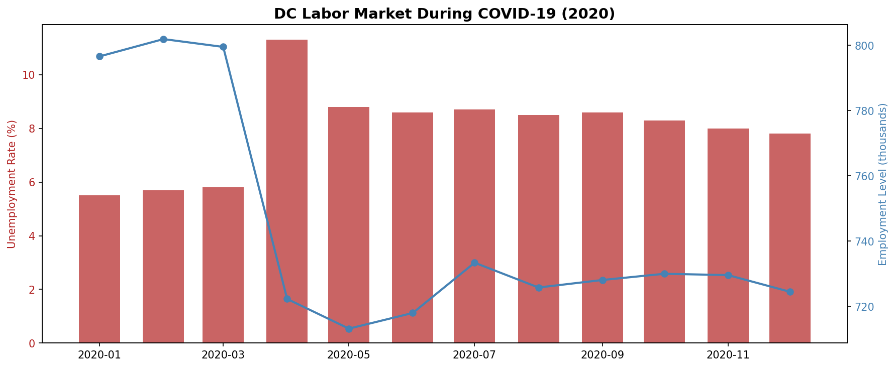

**07 Annual Unemployment**
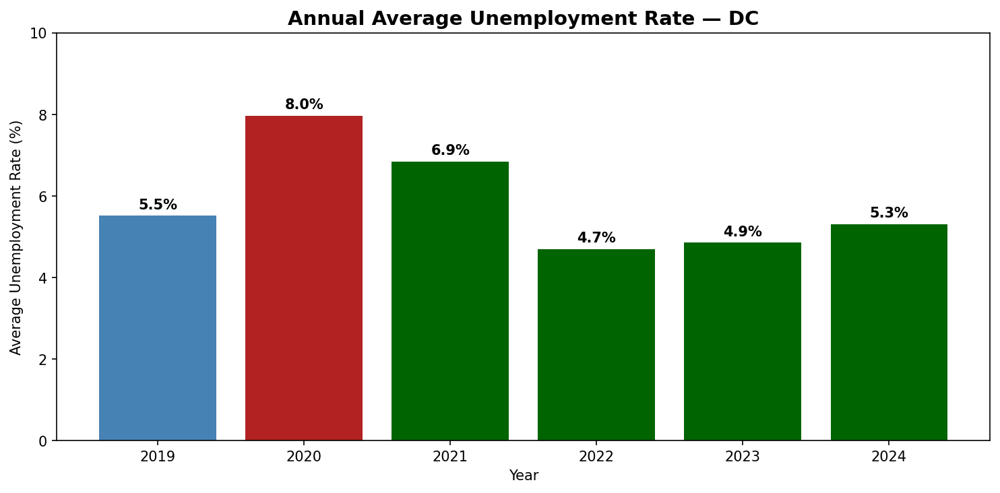

**08 Demo Cards**
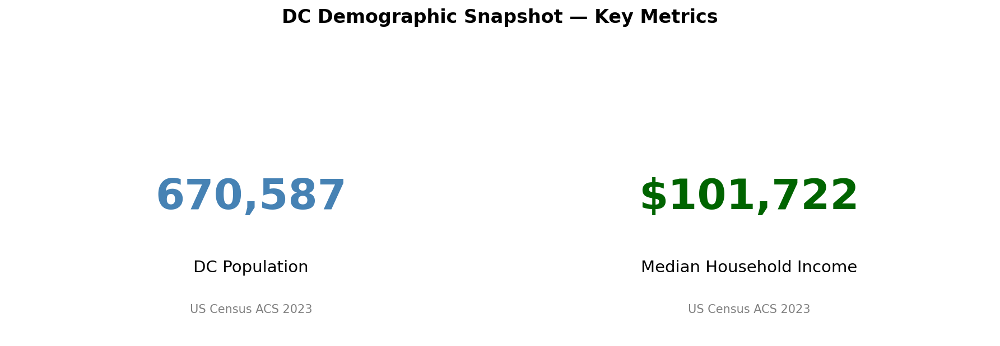

