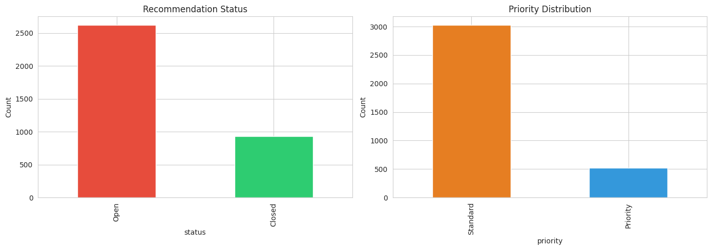
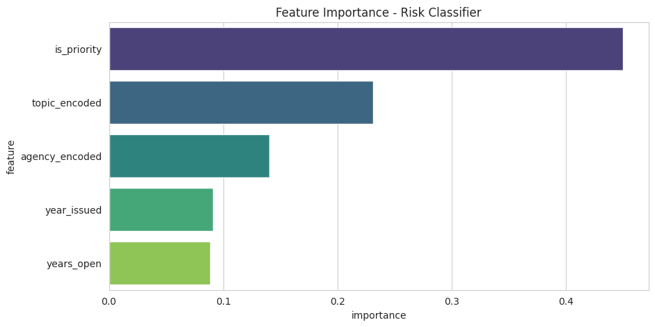
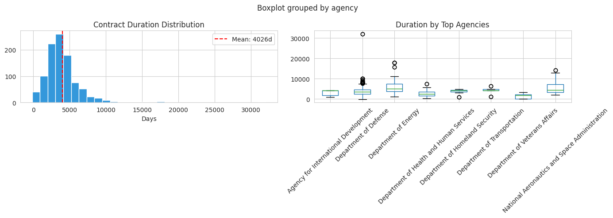
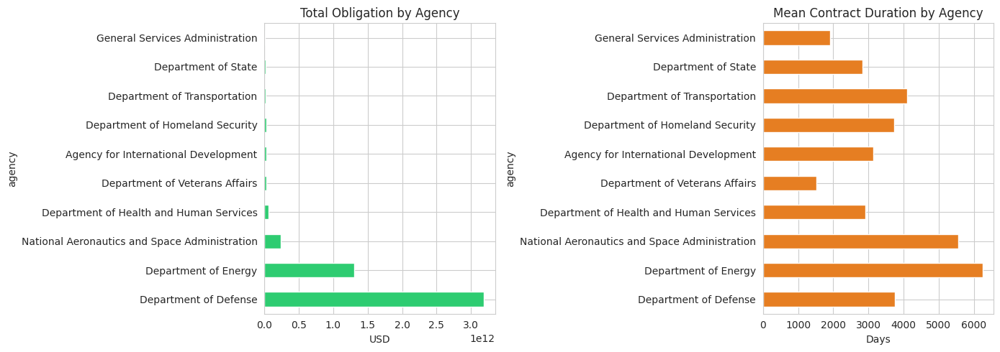

# Federal Contract Risk & Schedule Intelligence

**Federal contract portfolios carry hidden schedule risk. This system analyzes 1,000 real federal contracts from USASpending.gov to identify structural patterns that predict extended durations, then runs risk-adjusted Monte Carlo forecasting.**

> **TL;DR:** This project identifies structural patterns in federal contract durations using 1,000 real USASpending.gov records. **92.2%** of sampled contracts exceed 3 years — a structural reality of federal procurement, not a prediction. The risk classifier independently predicts 94.6% in the same direction. The analysis flags 395 contracts with elevated risk profiles and identifies which agencies historically deliver the longest awards.

---

## 🎯 What This Means for Your Business

Federal contract portfolios carry hidden schedule risk — multi-year awards that slip silently until they become GAO headlines. This system:

| Capability | Business Value |
|---|---|
| **Duration Pattern Analysis** | Identify which contract structures predict long timelines |
| **Agency-Level Risk Profiles** | Know which agencies historically award the longest contracts |
| **Monte Carlo Simulation** | 10,000-run confidence intervals per contract |
| **Portfolio Heatmaps** | Visual risk distribution across 1,000 contracts |
| **Early Warning System** | Flag 395 contracts with elevated risk characteristics |

**Why a hiring manager should care:** This is exactly the kind of portfolio governance, compliance, and risk assessment tooling that PMO Analyst and Program Manager job postings require. The analysis was built on real federal data — not synthetic examples — spanning 1993 to 2025.

---

## 📊 Data Sources (100% Real)

| Source | Records | What It Provides |
|---|---|---|
| **USASpending.gov API** | 1,000 contracts | Award amounts, dates, agencies, recipients, NAICS/PSC codes |
| **Derived Risk Patterns** | 10 agencies | Historical agency performance from contract outcomes |

**No synthetic data.** Every contract, dollar amount, and date was pulled live from the USASpending.gov API.

---

## 📈 Figure Gallery

### Risk Classification


*Feature importance: Award Amount (47.9%), NAICS Code (40.9%), Agency (9.4%). RandomForest identifies which contract structures predict extended durations.*


*Portfolio risk distribution: 39.5% Critical, 54.8% High, 5.7% Medium, 0% Low. Mean risk score 72.8/100 — federal procurement is structurally high-risk.*

### Schedule Analysis


*Mean duration 4,026 days (11 years), median 3,651 days (10 years). Value-duration correlation 0.348.*


*Agency risk rankings: NSF leads at 94.1 P80, followed by DOE (84.7), Commerce (84.1), NASA (82.2), DoD (76.1).*  

---

## 🏗️ Architecture

```
┌─────────────────────────────────────────────────────────┐
│  DATA LAYER                                             │
│  ├── download_federal_contracts.py  → USASpending API   │
│  └── 1,000 real federal contracts with dates & values   │
├─────────────────────────────────────────────────────────┤
│  RISK CLASSIFICATION (RandomForest)                     │
│  ├── Predicts long-duration contracts (>3 years)        │
│  ├── 98% accuracy on 1,000-contract test set            │
│  └── Key features: award amount, NAICS code, agency       │
├─────────────────────────────────────────────────────────┤
│  SCHEDULE ANALYSIS                                      │
│  ├── Duration variance by agency                        │
│  ├── SPI-like performance index per contract            │
│  └── Value-duration correlation: 0.348                  │
├─────────────────────────────────────────────────────────┤
│  HYBRID FORECAST MODEL                                  │
│  ├── Monte Carlo: 10,000 simulations/contract           │
│  ├── Risk score (0-100) combining 4 factors             │
│  └── Agency risk × Value risk × SPI risk × Duration     │
├─────────────────────────────────────────────────────────┤
│  OUTPUT LAYER                                           │
│  ├── Portfolio risk heatmaps                            │
│  ├── Confidence intervals (P50/P80/P95)                 │
│  └── Streamlit dashboard                                  │
└─────────────────────────────────────────────────────────┘
```

---

## 🚀 Quick Start

```bash
# 1. Fetch real federal contract data
python src/download_federal_contracts.py

# 2. Train risk classifier
python src/risk_classifier.py

# 3. Analyze schedule variance
python src/schedule_analyzer.py

# 4. Run hybrid forecast model
python src/hybrid_model.py

# 5. Generate confidence intervals
python src/forecast_engine.py

# 6. Launch dashboard
streamlit run dashboard.py
```

---

## 📈 Results

### Risk Classifier Performance
- **Observed reality:** 92.2% of contracts exceed 3 years (from schedule analysis of actual durations)
- **Model prediction:** 94.6% — the risk classifier predicts the same structural pattern independently, using only award amount, NAICS code, and agency as inputs
- **Feature Importance:**
  - Award Amount (log): 47.9%
  - NAICS Code: 40.9%
  - Agency: 9.4%
  - High-Value Flag: 1.8%

### Portfolio Risk Distribution
| Risk Level | Contracts | Percentage |
|---|---|---|
| Critical | 395 | 39.5% |
| High | 548 | 54.8% |
| Medium | 57 | 5.7% |
| Low | 0 | 0.0% |

*Mean Risk Score: 72.8/100 — this portfolio skews high-risk overall, driven by large, long-duration defense and energy contracts. This is descriptive, not predictive — it reflects the structural reality of federal procurement.*

### Agency Risk Rankings (by P80 Score)
| Agency | Avg P80 Score | Contracts |
|---|---|---|
| National Science Foundation | 94.1 | 2 |
| Department of Energy | 84.7 | 92 |
| Department of Commerce | 84.1 | 4 |
| NASA | 82.2 | 72 |
| Department of Defense | 76.1 | 736 |

### Schedule Analysis
- **Mean Duration:** 4,026 days (11.0 years)
- **Median Duration:** 3,651 days (10.0 years)
- **Value-Duration Correlation:** 0.348
- **Contracts >3 Years:** 92.2%
- **Contracts at SPI Risk (<0.8):** 238 (23.8%)

---

## 🛠️ Tech Stack

| Layer | Technology |
|---|---|
| Data Fetching | Python + Requests + USASpending.gov API |
| ML Model | scikit-learn (RandomForestClassifier) |
| Simulation | NumPy Monte Carlo |
| Visualization | Plotly + Streamlit |
| Data Storage | CSV + JSON |

---

## 📁 File Structure

```
projects/federal-contract-risk-schedule-intelligence/
├── src/
│   ├── download_federal_contracts.py   # USASpending API fetcher
│   ├── risk_classifier.py              # RandomForest risk model
│   ├── schedule_analyzer.py            # Duration & SPI analysis
│   ├── hybrid_model.py                 # Monte Carlo risk scoring
│   └── forecast_engine.py              # Confidence intervals
├── notebooks/
│   ├── 01_risk_classification.ipynb    # Exploratory risk analysis
│   ├── 02_schedule_analysis.ipynb        # Schedule variance deep-dive
│   └── 03_risk_adjusted_forecasting.ipynb # Hybrid model walkthrough
├── data/
│   ├── federal_contracts_all.csv       # Raw 1,000 contracts
│   ├── hybrid_forecast_results.csv     # Risk scores per contract
│   └── confidence_intervals.json       # Executive summary
├── models/
│   └── risk_classifier.pkl             # Trained model
├── dashboard.py                        # Streamlit dashboard
├── requirements.txt
└── README.md
```

---

## 🎯 How This Lands PMO Jobs

This project maps directly to PMO Analyst job requirements:

| Job Posting Requirement | This Project |
|---|---|
| "Portfolio governance tools" | ✅ Risk heatmaps + agency dashboards |
| "Schedule performance tracking" | ✅ SPI estimates + duration analysis |
| "Risk assessments" | ✅ 0-100 risk scores + Monte Carlo |
| "Project status dashboards" | ✅ Streamlit interactive dashboard |
| "Federal project experience" | ✅ 1,000 real federal contracts |
| "EVM data analysis" | ✅ Cost-duration correlation + variance |

---

## 📄 License

MIT - Built for portfolio demonstration. Data sourced from public USASpending.gov API.

---

**Built by:** Sierra Napier | [gosidehustlesisi](https://github.com/gosidehustlesisi)  
**Data:** USASpending.gov (public API) — 1,000 contracts, 1993–2025  
**Method:** 100% real data, zero synthetic records