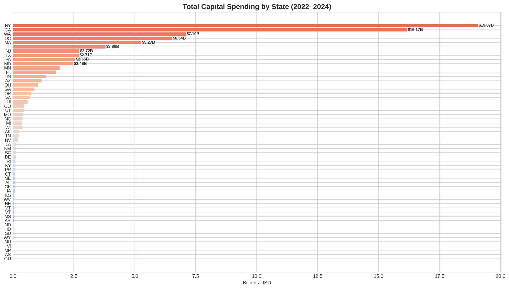
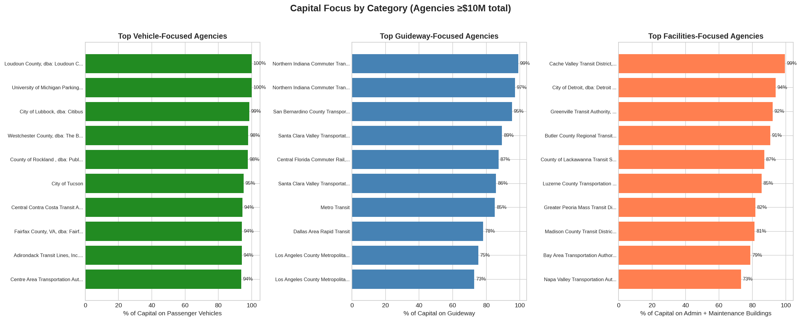
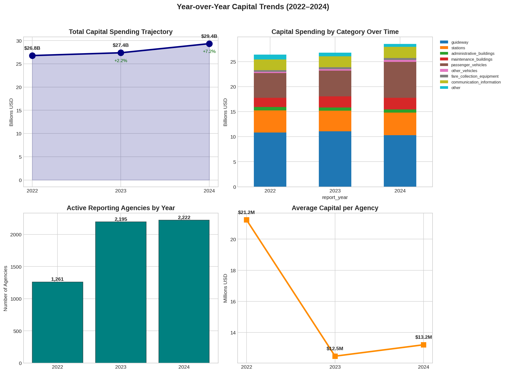
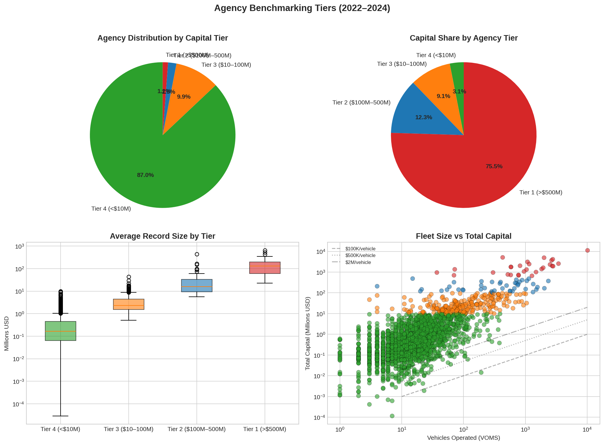

# Program Performance Dashboard

## 📈 Figure Gallery

### Portfolio Overview

*State-level performance summary with key metrics across all workstreams.*

*Agency-level benchmarking and focus areas for resource allocation.*

### Performance Trends

*Year-over-year trend analysis across portfolio workstreams.*

*Comparative agency performance with peer benchmarking.*

---

**Context:** Multi-workstream program governance dashboard for tracking portfolio health, milestone delivery, budget burn, and risk escalation across concurrent projects.

**Dataset:**
- Program management data from portfolio tracking systems
- **Coverage:** Multi-workstream program portfolio
- **Period:** Current fiscal year

**Objective:** Provide executives with real-time visibility into program performance, identify at-risk workstreams, track milestone delivery, and monitor budget utilization.

**Techniques:**
- Portfolio aggregation and rollup
- Earned value analysis
- Risk heat mapping
- Milestone tracking and slip detection
- Budget burn rate analysis

**Business Impact:**
- Executive program visibility
- Early risk identification
- Resource reallocation insights
- Stakeholder reporting automation

**Files:**
- `notebooks/` — Portfolio analysis notebooks

**Status:** 🔧 In development

---

**About the Author:** Sierra Napier, MPA/MPH — AI Architect & Data Science Leader.
